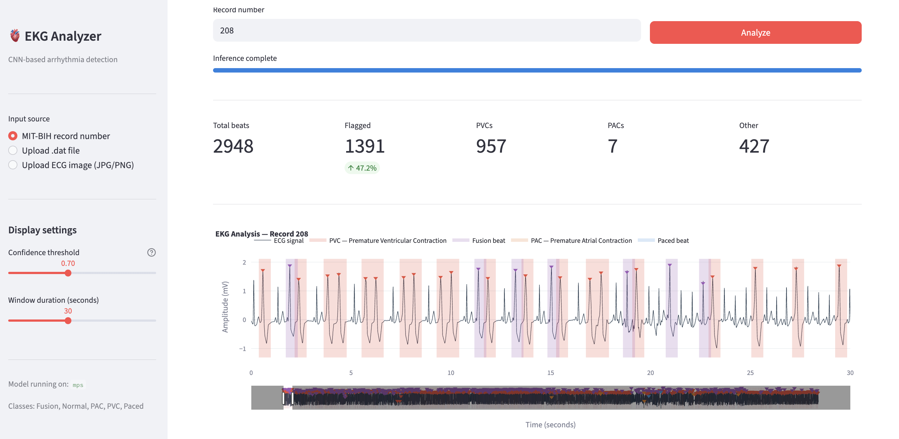
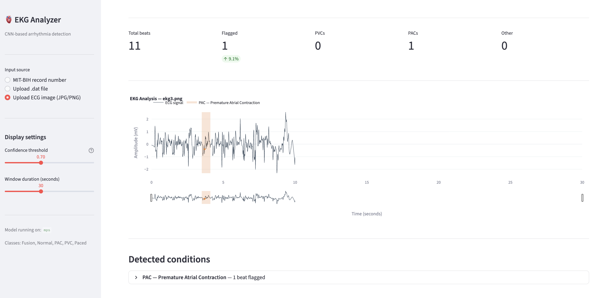

# EKG Beat Analyzer
## Purpose

After working as an intern at a local Family Medicine clinic for two years, I realized that setting up EKGs on elderly patients and having to print out physical copies of EKG results from the machine for approval by the primary care physician was a process that was inefficient, keeping patients hooked into wires and held within waiting rooms for longer than necessary. Through this EKG analysis tool, I sought to develop a method to directly analyze EKG results electronically, as many EKGs typically export patient results in .png format. By using this tool, doctors can focus on patients that are deemed to have heart irregularities at a high confidence level and locate highlighted areas of concern much more efficiently. I hope this tool allows doctors to streamline the EKG process, allowing patients to spend less time attached to EKG machines as well as saving more time for doctors to spend directly consulting patients. 

This project uses data from the EKG records from 15 patients from the MIT-BIH Arrhymtia Database, taking multiple 30-minute samples from each patient and hundreds of thousands of heartbeat samples. Models using 1D convolutional neural networks were generated and applied to predict EKG results of random patients.
## Summary 
A CNN-based ECG analysis tool built for clinical settings. Accepts ECG recordings or scanned images as input, detects R-peaks, classifies each beat, and flags abnormal regions with condition labels and confidence scores in an interactive Streamlit interface.

> **Clinical disclaimer:** This tool is intended to assist clinical review only. It is not a substitute for physician interpretation.


## Features

- Accepts MIT-BIH `.dat` files, uploaded `.dat/.hea` file pairs, or scanned ECG images (JPG/PNG)
- Detects and segments individual beats using NeuroKit2
- Classifies beats into five categories: Normal, PVC, PAC, Fusion, and Paced
- Highlights abnormal regions on an interactive zoomable ECG chart
- Displays confidence scores and full probability breakdowns per beat
- Exports flagged beats as a CSV for clinical records
- Runs on Apple MPS (M1/M2/M3), CUDA, or CPU



---

## Project structure

```
ekg_analyzer/
├── app.py                  — Streamlit web application
├── utils.py                — Model, inference, and signal processing utilities
├── image_processing.py     — ECG image → signal extraction pipeline
├── data/
│   ├── mitdb/              — MIT-BIH PhysioNet records (.dat, .hea, .atr)
│   └── processed/          — Saved beat segments and labels from Phase 2-3
├── models/
│   ├── ecg_cnn.pth         — Trained CNN with metadata (used by app)
│   └── ecg_cnn_best.pth    — Best checkpoint saved during training
└── notebooks/
    ├── phase1_data_loading.ipynb
    ├── phase2_peak_detection.ipynb
    ├── phase3_classifier.ipynb
    ├── phase4_cnn.ipynb
    └── phase5_highlighting.ipynb
```

---

## Setup

### Requirements

- Python 3.9 or later
- pip

### Install dependencies

```bash
pip install torch torchvision
pip install streamlit plotly wfdb neurokit2
pip install scikit-learn imbalanced-learn
pip install opencv-python-headless Pillow scipy
pip install numpy pandas matplotlib seaborn
```

### Download the dataset

The app uses the [MIT-BIH Arrhythmia Database](https://physionet.org/content/mitdb/1.0.0/) from PhysioNet. Run this once inside any notebook to download the records used for training:

```python
import wfdb

records = [
    '100', '101', '104', '105', '106',
    '108', '109', '111', '119', '200',
    '201', '202', '203', '205', '208'
]

wfdb.dl_database('mitdb', dl_dir='./data/mitdb', records=records)
```

---

## Running the app

From the project root:

```bash
streamlit run app.py
```

The app will open automatically at `http://localhost:8501`.

---

## Input modes

### MIT-BIH record number
Enter a record number (e.g. `119`, `208`) from the MIT-BIH database already downloaded to `./data/mitdb/`. Click **Analyze** to run inference on the full recording.

### Upload .dat file
Upload a `.dat` and `.hea` file together — both files are required and must come from the same record. Compatible with any PhysioNet WFDB-format recording.

### Upload ECG image (JPG/PNG)
Upload a scanned or photographed ECG printout. Enter the recording duration shown in the image (in seconds). The app will extract the signal trace, remove the grid, resample to 360Hz, and run the same inference pipeline as the other input modes.

**Image quality guidance:**

| Image type | Expected result |
|---|---|
| Flat scanner scan, clean paper | Best |
| High-res photo, good lighting | Good |
| Phone photo at an angle | Poor |
| Faded or low-contrast print | Poor |

Use the **Show image processing steps** expander after uploading to verify the grid removal step looks correct before running analysis.

---

## How it works

### Signal pipeline

```
Input (record / file / image)
        ↓
wfdb or image extractor → raw numpy signal
        ↓
NeuroKit2 ecg_clean() → noise and baseline removal
        ↓
NeuroKit2 ecg_peaks() → R-peak sample indices
        ↓
Beat segmentation → 216-sample windows (0.2s pre, 0.4s post R-peak)
        ↓
Per-beat normalization (zero mean, unit variance)
        ↓
CNN inference → class probabilities via softmax
        ↓
Plotly chart with colored highlights + results table
```

### CNN architecture

A 1D convolutional neural network trained on the MIT-BIH Arrhythmia Database:

- **Block 1:** Conv1D(1→32, k=7) → BatchNorm → ReLU → MaxPool → Dropout(0.3)
- **Block 2:** Conv1D(32→64, k=5) → BatchNorm → ReLU → MaxPool → Dropout(0.3)
- **Classifier:** Flatten → Linear(3456→128) → ReLU → Dropout(0.5) → Linear(128→5)

Trained with weighted random sampling and cross-entropy loss to handle class imbalance. Early stopping monitors validation loss with patience of 10 epochs.

### Beat classification

| Class | Description | Color |
|---|---|---|
| Normal | Normal sinus beat | Green |
| PVC | Premature Ventricular Contraction | Red |
| PAC | Premature Atrial Contraction | Orange |
| Fusion | Fusion of normal and ventricular beat | Purple |
| Paced | Pacemaker-triggered beat | Blue |

### Confidence scoring

Each beat passes through softmax to produce a probability distribution across all five classes. The highest probability becomes the predicted class and its value is the confidence score. Only beats above the confidence threshold set in the sidebar are highlighted. Beats below the threshold are analyzed but not flagged — the default threshold is 70%.

---

## Training the model

Each notebook in `notebooks/` corresponds to one phase of the training pipeline. Run them in order. Each notebook adds `os.chdir('..')` as its first cell to resolve paths relative to the project root.

| Notebook | Purpose |
|---|---|
| `phase1_data_loading.ipynb` | Download MIT-BIH, visualize raw signals and annotations |
| `phase2_peak_detection.ipynb` | Detect R-peaks, segment beats, save to `data/processed/` |
| `phase3_classifier.ipynb` | Train Random Forest baseline, evaluate, save model |
| `phase4_cnn.ipynb` | Train CNN, early stopping, save `models/ecg_cnn.pth` |
| `phase5_highlighting.ipynb` | Test inference and highlighting logic before building the app |

### Model performance (Random Forest baseline vs CNN)

| Class | RF F1 | CNN F1 |
|---|---|---|
| Normal | 0.99 | 0.99 |
| PVC | 0.97 | 0.95 |
| Paced | 0.99 | 0.99 |
| Fusion | 0.84 | 0.82 |
| PAC | 0.71 | 0.61 |

PAC is the most challenging class due to its near-identical QRS morphology to Normal beats. Recall on PAC is 0.88, meaning the model catches the majority of PAC beats while producing some false positives.

---

## App controls

| Control | Location | Description |
|---|---|---|
| Input source | Sidebar | Switch between record number, file upload, or image upload |
| Confidence threshold | Sidebar | Minimum confidence to flag a beat (default 0.70) |
| Window duration | Sidebar | Seconds of ECG visible in the chart at once |
| Range slider | Below chart | Scrub across the full recording |
| Pan / zoom | Chart toolbar | Plotly native navigation tools |
| Download CSV | Results table | Export flagged beats with timestamps and conditions |

---

## Known limitations

- PAC classification has lower precision than other classes — expect some false positives
- Image-based signal extraction accuracy depends heavily on scan quality and image angle
- The model was trained on the MIT-BIH database (2-lead, 360Hz) and may perform differently on recordings from other devices or lead configurations
- Recording duration must be entered manually for image uploads — incorrect values will shift beat timing in the output

---

## Dataset

**MIT-BIH Arrhythmia Database**
Moody GB, Mark RG. The impact of the MIT-BIH Arrhythmia Database. IEEE Eng in Med and Biol 20(3):45-50 (May-June 2001).
PhysioNet: https://physionet.org/content/mitdb/1.0.0/

---

## Built with

- [PyTorch](https://pytorch.org/) — CNN training and inference
- [NeuroKit2](https://neuropsychology.github.io/NeuroKit/) — ECG signal cleaning and R-peak detection
- [WFDB](https://github.com/MIT-LCP/wfdb-python) — PhysioNet record reading
- [Streamlit](https://streamlit.io/) — Web application framework
- [Plotly](https://plotly.com/python/) — Interactive ECG chart
- [OpenCV](https://opencv.org/) — ECG image preprocessing
- [scikit-learn](https://scikit-learn.org/) — Random Forest baseline and evaluation metrics
- [imbalanced-learn](https://imbalanced-learn.org/) — SMOTE for class balancing
